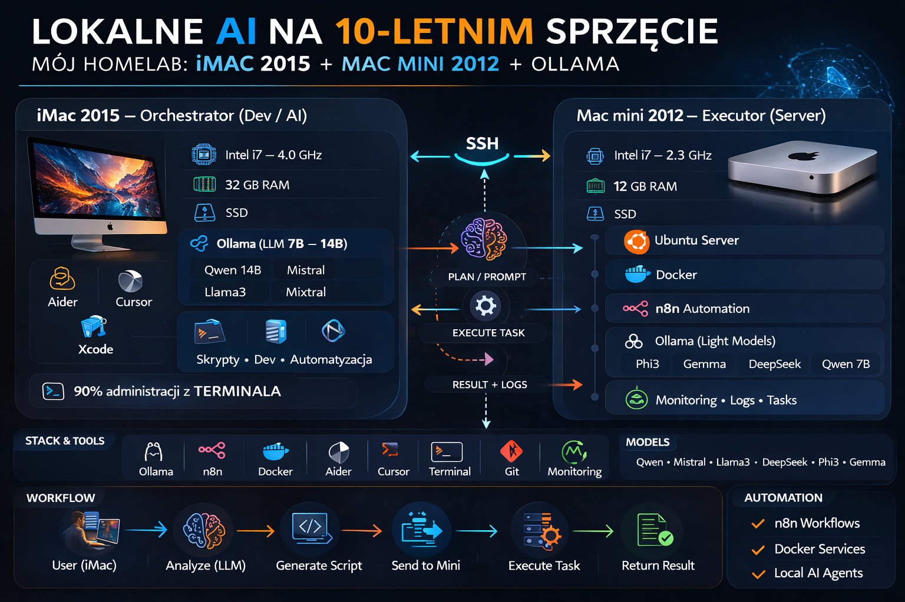

# AI Homelab on 10-Year-Old Hardware

Local AI homelab running **Ollama + Docker + n8n** on:

• iMac 2015 (32GB RAM)  
• Mac mini 2012 server (12GB RAM)

• CPU-only LLMs  

Experimenting with **local AI orchestration and automation**.


## Architecture



# ai-homelab-imac-mini
Local AI homelab on old hardware (iMac 2015 + Mac mini 2012) running Ollama, Docker and n8n

# Local AI Homelab on 10-Year-Old Hardware

## iMac 2015 + Mac mini 2012 + Ollama + Docker + n8n

## Why this project

This project explores how far **local AI infrastructure** can be pushed on older hardware without GPUs.

The goal is to build a small self-hosted AI environment capable of:

• running local LLMs  
• orchestrating tasks  
• automating workflows  
• experimenting with multi-agent systems
I wanted to see how far I could go with **local AI on old hardware**.

Instead of buying GPUs or cloud compute, I built a small **AI homelab** using two machines I already had.

Surprisingly… it works really well.

---

# Hardware

## iMac 2015 — Main AI Node (Orchestrator)

- Intel Core i7 — 4.0 GHz
- 32 GB RAM
- SSD
- macOS

This machine runs the main **local LLM models** and acts as the **AI orchestrator**.

---

## Mac mini 2012 — Server / Executor

- Intel Core i7 — 2.3 GHz
- 12 GB RAM
- SSD
- Ubuntu Server

The Mac mini works as a **home server** handling:

- Docker containers
- n8n automation
- task execution
- monitoring

---

# Software Stack

## On iMac

- Ollama
- local LLM models
- Aider
- Cursor IDE
- Xcode (learning)
- SSH access to Mac mini

About **90% of administration is done through the terminal.**

---

## On Mac mini

- Ubuntu Server
- Docker
- n8n
- Ollama (light models)

---

# LLM Models Tested

- Qwen 14B
- Qwen 7B
- Mistral
- Mixtral
- DeepSeek Coder
- Phi3
- Llama
- Gemma

Biggest surprise:

**Qwen 14B runs surprisingly well on CPU with 32GB RAM.**

---

# Architecture

Two-node system with two agents.

### Agent 1 — Orchestrator (iMac)

Responsible for:

- analyzing tasks
- planning execution
- generating scripts
- delegating work

### Agent 2 — Executor (Mac mini)

Responsible for:

- running tasks
- Docker management
- automation
- services

---

# Stack

- Ollama
- Docker
- n8n
- Aider
- Cursor
- Terminal workflows

---

# Workflow

```
User (iMac)
     ↓
LLM Analysis
     ↓
Generate Script / Plan
     ↓
Send task to Mac mini
     ↓
Execution
     ↓
Return result
```

---

# Why this project

This is mostly an **experiment and learning project**.

I wanted to see if it’s possible to build a **useful local AI environment without GPUs or cloud services**.

The answer so far:

**Yes — and it works better than expected.**

---

# Notes

The architecture and documentation were prepared with the help of **ChatGPT**, based on my real setup.

---

# Future plans

- multi-LLM routing
- deeper automation with n8n
- better monitoring
- agent communication layer

---

# If you run a similar setup

I would love to hear:

- what LLM models work best on CPU
- how people structure local AI automation
- ideas for improving this architecture
